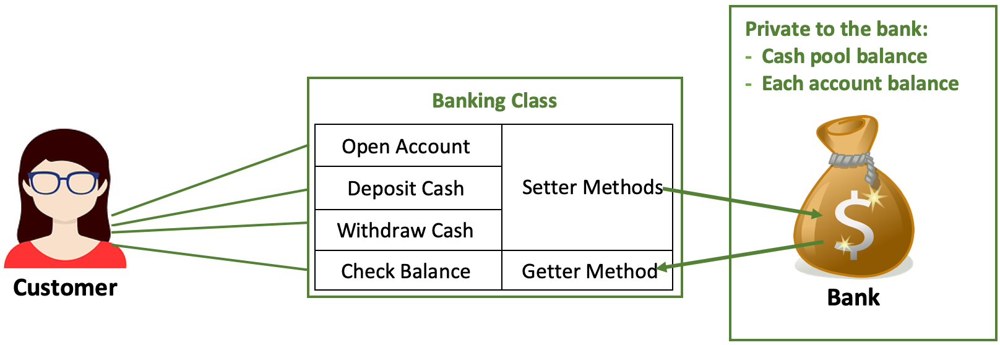
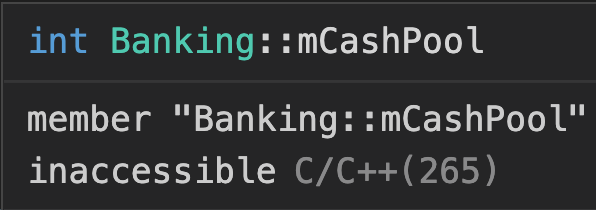

# Assignment: Encapsulation - Object Oriented Programming (OOP)

## Objective

In this assignment, you will apply the concept of encapsulation in object oriented programming to create a simple banking system – open account, deposit cash, withdraw cash and check balance.

## Prior Knowledge

To complete this assignment, you:

1. have had a good understanding of Classes and Objects, Class Methods, Constructor and Access Specifiers in OOP.
2. have completed Introduction to Programming (CS 10A) and Programming Concept 1 (CS 10B)

## Your Task

1. Use C++17 or above.
2. Create a class in a .cpp file.
3. Implement a banking use case that applies the concept of encapsulation, makes use of the **private** access specifier, **Setter** and **Getter methods**. In the banking use case, a customer is prompted to open an account with a minimum amount of cash. Once the account is opened, the customer will be given options to deposit cash, withdraw cash, check balance and exit the banking system.
4. For simplicity, you can assume this banking system serves 1 customer at a time.
5. Implement **Setter methods** for opening an account, depositing cash and withdrawing cash.
6. Implement a **Getter method** for checking account balance.
7. Use **private** access specifier to prevent cash from being accessed directly outside of the class.
8. **Setter** and **Getter methods** are the only channels to access the private attributes from outside of the class.

## Assignment Submission

1. Your completed assignment is a .cpp sourse file.
2. Submit the sourse file to Canvas.

## Assignment Due Date

March 3, 2023 before class

## Use Case - Banking System

**Private** access specifier – members (attributes and methods) cannot be accessed or view from outside of the class.

**Setter method** is used to set or update the value of a variable (members attributes) outside the encapsulating class.

**Getter method** is used to retrieve the value of a variable (members attributes) outside the encapsulating class.

In this use case, a customer can perform four (4) types of transactions on the banking system:

1. open account
2. deposit cash
3. withdraw cash
4. check balance

To start, the banking system prompts a customer to enter an amount to open an account. The system should set a minimum amount for opening an account. If the amount doesn't fulfill the requirement, the system will prompt the customer to contact customer services before exiting.

Once successfully opened an account, the customer is provided four (4) options:

1. deposit cash
2. withdraw cash
3. check balance
4. exit the system

These options should be cycled until the customer selects "exit the system".

**Note**: open account is a 1-time execution task and not included in the cycle.

As normal banking operations, deposit cash increments the account balance, withdraw cash decrements account balance and check balance retrieves account balance.

Besides each individual customer account balance, the banking system also keeps a cash pool of all customers accounts. This cash pool should only be accessed within the banking system, that means no customer or others outside of the bank can reach the cash pool.

**Note**:

1. In object oriented programming, that means no object created from the banking class can directly access the cash pool that declared as a `private:` class member.
2. No Setter or Getter method should be implemented to access the cash pool in this banking system because this is a customer use case.
3. However, the cash pool should be incremented and decremented when the deposit and withdraw transactions are executed.

To test the cash pool is set up correctly, try to access the cash pool declared as `private: mCashPool` from an object created from the banking class, e.g. `myBanking.mCashPool`, you will get an error message similar to this --

.

## Starter Code

This repository provides a basic code structure and inline documentation for you to get started. `Banking.cpp` includes a class structure and a `main()` outside of the class for implementing this banking system use case.

Happy Coding!
